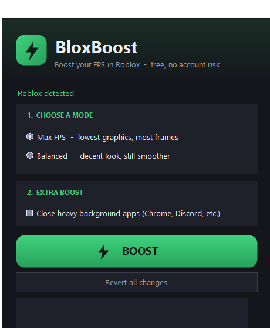

# BloxBoost — Roblox FPS Booster & Optimizer

**Free, lightweight Windows app that boosts your FPS in Roblox.** Built for low-end PCs and laptops: one click lowers heavy graphics and tunes Windows for gaming, so Roblox runs smoother.

<p align="center">
  
</p>

> BloxBoost does **not** modify the Roblox program and does **not** inject anything into the game. It only writes Roblox's own graphics settings and adjusts Windows. No account risk.

## Features
- ⚡ **One-click Boost** — apply optimised graphics + system tweaks instantly
- 🎮 **Two modes** — *Max FPS* (lowest graphics, most frames) or *Balanced* (still looks decent)
- 🧹 **Frees up RAM** and sets the High Performance power plan
- 🚀 **Raises Roblox priority** so it gets more CPU
- 🧯 **Revert button** — undo everything in one click
- 🪶 **Tiny & portable** — single .exe, no install, nothing left behind

## How it works
1. Writes Roblox graphics FastFlags into `ClientSettings\ClientAppSettings.json` (disables post-processing, shadows, grass, anti-aliasing → big FPS gain on weak hardware).
2. Switches Windows to High Performance, trims standby memory, raises the Roblox process priority.

Because it never touches the running game, it's compatible with Roblox's anti-cheat and won't get your account banned.

## Usage
1. Download the latest `BloxBoost.exe` from [Releases](../../releases).
2. Run it. Pick **Max FPS** or **Balanced**, click **BOOST**.
3. Restart Roblox if it was open, join a game, press **Shift + F5** to see your FPS.
4. To undo, open BloxBoost and click **Revert all changes**.

> **Note:** BloxBoost is free and unsigned, so Windows SmartScreen may say "Unknown publisher". Click **More info → Run anyway**. The full source is in this repo — you can review and build it yourself.

## Build from source
Requires the .NET SDK on Windows:
```
dotnet build -c Release
```
Output: `bin/Release/net48/BloxBoost.exe` (targets .NET Framework 4.8, preinstalled on Windows 10/11).

## Disclaimer
BloxBoost is a third-party tool, not affiliated with Roblox Corporation. Use at your own discretion. Graphics-flag effectiveness depends on the current Roblox client; the Windows optimisations apply regardless.
